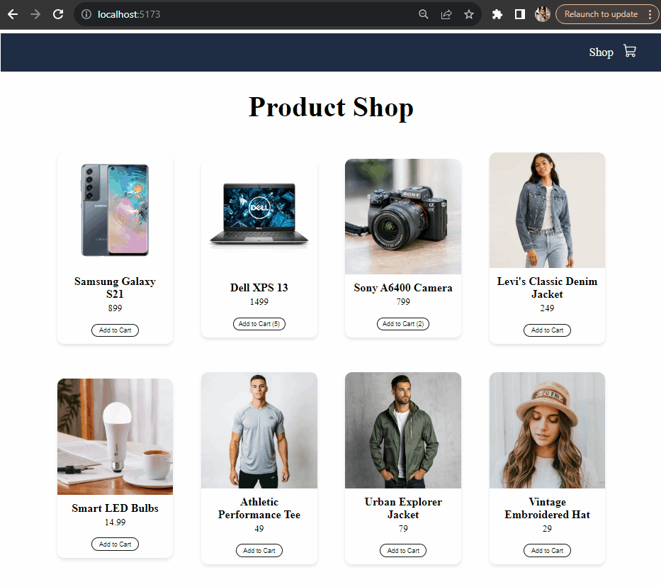

🔔 🔔 🔔
---
# React Shopping Cart Project

## Overview

Welcome to the **react-shopping-cards** project! The primary aim of this project is to explore key concepts and gain hands-on experience with essential libraries within the React ecosystem. This is a purely frontend project, utilizing mock data for a seamless user experience. The project's boilerplate was created using Vite.


## Key Concepts Explored

- **React Router Basics:** Navigating through the fundamentals of React Router for seamless page navigation.
- **phosphor-react Library:** Integrating the phosphor-react library for delightful icons and visual elements.
- **React Context API:** Utilizing the power of React Context API for efficient state management.
- **useContext Hook:** Exploring the useContext hook to streamline data access across components.
- **useNavigate from 'react-router-dom':** Leveraging useNavigate for efficient programmatic navigation.


**Example of content of products.js file:**
```
[
    {
        id: 1,
        productName: 'Samsung Galaxy S21',
        price: 899.0,
        productImage: product1,
    },

    ...

    {
        id: 8,
        productName: 'Vintage Embroidered Hat',
        price: 29.0,
        productImage: product8,
    },
]

```

## Installation

1. Clone the repository or download the source code.

    `git clone https://github.com/ElenaCoder/react-shopping-cards`

3. Navigate to the right directory.

    `cd react-shopping-cards`

2. Install the dependencies.

    `npm install`


## Usage

1. Start the development server.

    `npm run dev`

2. This will start the development server, and you can view the React application in your web browser at http://localhost:5173.

## Deployment

This project is deployed and can be accessed at [this link:](https://elenacoder.github.io/react-shopping-cards)

The deployment is done using GitHub Pages, which provides free hosting for static websites.


## Project preview

Explore a sneak peek of the **react-shopping-cards** project with this animated GIF showcasing key features and the user interface.



## License

This project is licensed under the MIT License.

---